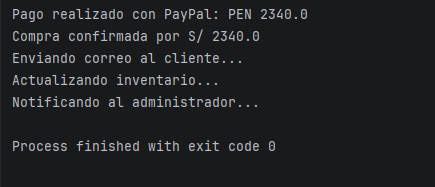

# Virtual Store — Implementación de Patrones de Diseño en Java

## Descripción del problema

Se desarrolló una tienda virtual desde consola donde un cliente puede agregar productos a un carrito, seleccionar un método de descuento, pagar con distintos procesadores y recibir notificaciones automáticas al confirmar su compra. El sistema demuestra el uso de tres patrones de diseño aplicados a problemas concretos.

---

## Patrones implementados

### 1. Strategy — Descuentos

**Propósito:** Permite definir múltiples algoritmos de descuento e intercambiarlos sin modificar la lógica del carrito.

**Aplicación en el proyecto:** El `Cart` tiene una referencia a `DiscountStrategy`. Al calcular el total, delega el cálculo del descuento a la estrategia configurada. Esto permite cambiar el tipo de descuento en tiempo de ejecución simplemente haciendo `cart.setDiscountStrategy(new PercentageDiscountStrategy(10))` sin tocar ninguna otra clase.

| Estrategia | Comportamiento |
|---|---|
| `NoDiscountStrategy` | Devuelve el total sin cambios |
| `PercentageDiscountStrategy` | Aplica un porcentaje de descuento |
| `FixedAmountDiscountStrategy` | Resta un monto fijo al total |

---

### 2. Adapter — Métodos de pago

**Propósito:** Permite que clases con interfaces incompatibles trabajen juntas sin modificar su código original.

**Aplicación en el proyecto:** La tienda define su propia interfaz `PaymentProcessor` con el método `pay(double amount)`. El servicio externo `ExternalPayPalService` tiene una firma distinta: `makePayment(String currency, double amount)`. El `PayPalAdapter` actúa como puente, implementando `PaymentProcessor` y traduciendo internamente la llamada al formato de PayPal.

```
Tienda → PaymentProcessor.pay(amount)
                ↓
         PayPalAdapter (traduce)
                ↓
ExternalPayPalService.makePayment("PEN", amount)
```

---

### 3. Observer — Notificaciones de compra

**Propósito:** Define una dependencia uno-a-muchos: cuando el sujeto cambia de estado, todos sus observadores son notificados automáticamente.

**Aplicación en el proyecto:** `OrderService` actúa como sujeto. Al confirmar una compra, llama a `notifyObservers()` que itera sobre todos los `OrderObserver` registrados. Esto permite agregar o quitar canales de notificación sin modificar `OrderService`.

| Observador | Acción |
|---|---|
| `EmailNotificationObserver` | Simula envío de correo al cliente |
| `InventoryObserver` | Actualiza el registro de inventario |
| `AdminNotificationObserver` | Notifica al administrador |

---

## Estructura del proyecto

```
virtual-store/
├── src/
│   ├── Main.java
│   ├── model/
│   │   ├── Product.java
│   │   └── Cart.java
│   ├── strategy/
│   │   ├── DiscountStrategy.java
│   │   ├── NoDiscountStrategy.java
│   │   ├── PercentageDiscountStrategy.java
│   │   └── FixedAmountDiscountStrategy.java
│   ├── adapter/
│   │   ├── PaymentProcessor.java
│   │   ├── ExternalPayPalService.java
│   │   ├── PayPalAdapter.java
│   │   └── CreditCardPaymentProcessor.java
│   │   
│   ├── observer/
│   │   ├── OrderObserver.java
│   │   ├── EmailNotificationObserver.java
│   │   ├── InventoryObserver.java
│   │   └── AdminNotificationObserver.java
│   └── service/
│       └── OrderService.java
└── README.md
```

---

## Salida esperada en consola

```
Pago realizado con PayPal: PEN 2340.0
Compra confirmada por S/ 2340.0
Enviando correo al cliente...
Actualizando inventario...
Notificando al administrador...

```
## Imagen

